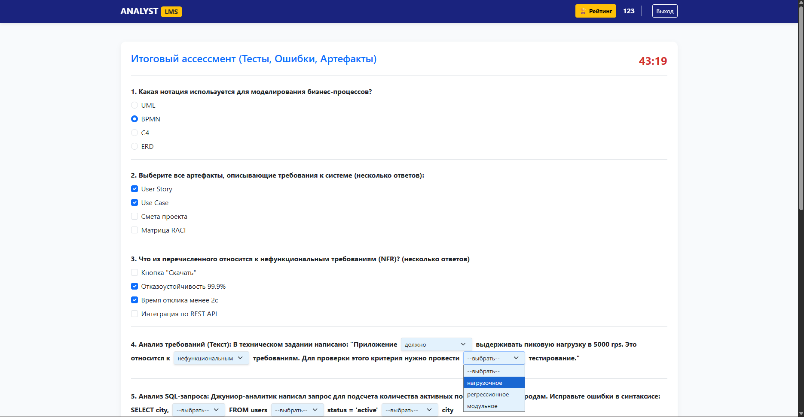
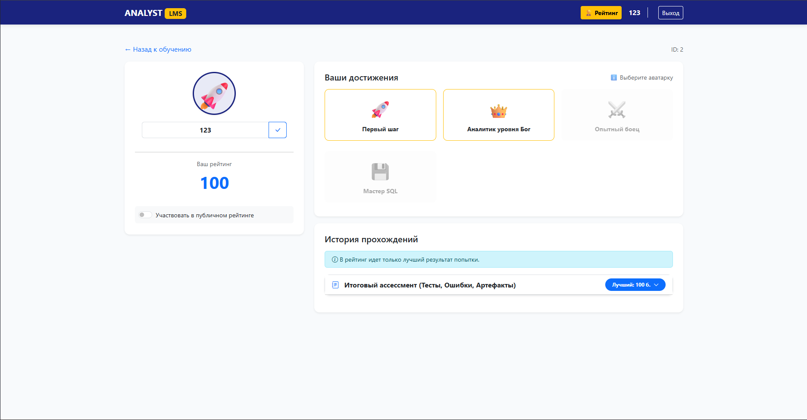
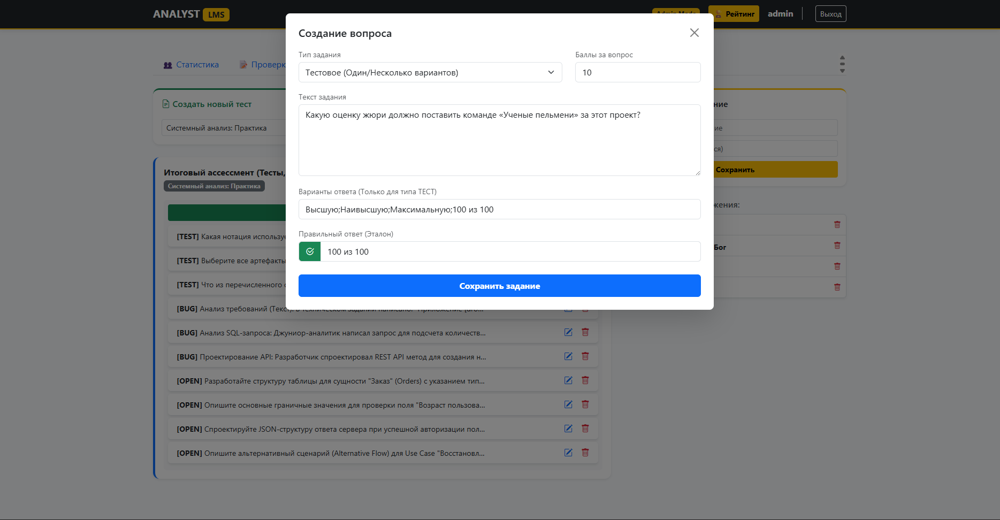
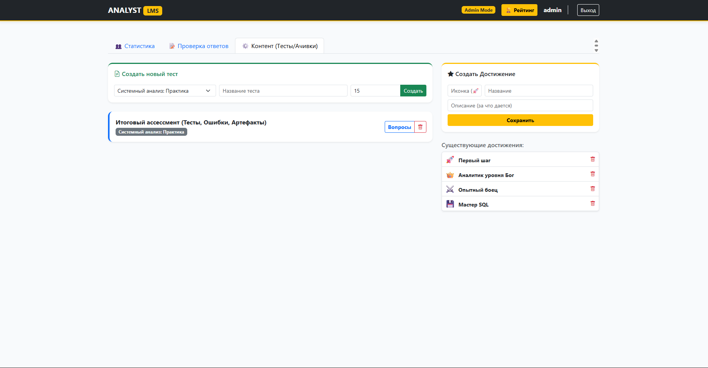
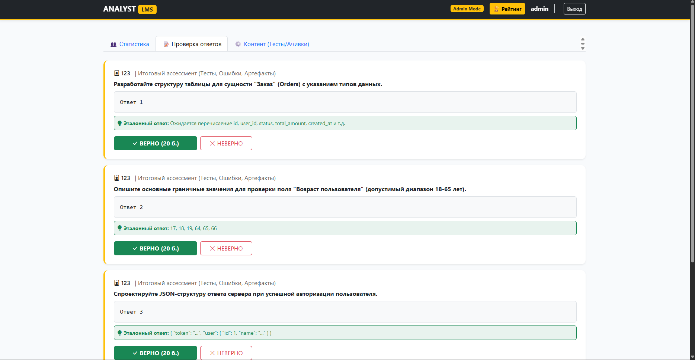

# Analyst LMS Pro 

**Analyst LMS Pro** — это backend-сервис (и встроенное демонстрационное веб-приложение) тренажёра для аналитиков. Платформа позволяет junior/middle-специалистам, студентам и сотрудникам корпоративных команд отрабатывать практические hard-skills в безопасной и контролируемой среде.

Проект разработан в рамках кейса «Тренажёр аналитики» командой **«Ученые пельмени»**.

---

## Ключевые возможности

### Для пользователей (Студентов)
* **Аутентификация и безопасность:** Регистрация и вход с использованием JWT-токенов и хэшированием паролей (BCrypt).
* **Прохождение заданий:** Поддержка 3 типов вопросов: закрытые тесты, поиск ошибок (выпадающие списки в тексте) и открытые задания (SQL).

> **Демонстрация прохождения интерактивного теста:**
>
> 

* **Мгновенная обратная связь:** Автоматическая проверка закрытых заданий и SQL-запросов сразу после сдачи теста.
* **Геймификация и Личный кабинет:** Начисление баллов, публичный рейтинг, система достижений (ачивок) и просмотр истории попыток.

> **Личный кабинет студента с историей и достижениями:**
>
> 


### Для Администраторов
* **Конструктор заданий:** Полное управление учебным контентом. Администратор может создавать темы, тесты и добавлять вопросы прямо через интерфейс. Поддерживается выбор всех требуемых по ТЗ типов заданий (Тестовые, Поиск ошибок, Открытые) с автоматической генерацией полей.

> **Конструктор создания нового вопроса:**
>
> 

* **Управление геймификацией:** Создание новых достижений в системе, а также ручная выдача/изъятие ачивок.

> **Управление контентом и геймификацией в панели администратора:**
>
> 

* **Ручная проверка:** Оценка открытых ответов пользователей, которые невозможно проверить автоматически (система подсвечивает эталонный ответ для проверяющего).

> **Интерфейс ручной проверки работ:**
>
> 
---

## Стек технологий

Проект строго следует техническим ограничениям кейса (без использования Spring Framework).

* **Язык:** Java 17
* **API Фреймворк:** Javalin 6 (REST API)
* **База данных:** PostgreSQL 15
* **Доступ к БД:** JDBC + пул соединений HikariCP
* **Безопасность:** JWT (JSON Web Tokens), jBcrypt
* **Сборка:** Maven
* **Инфраструктура:** Docker, Docker Compose
* **Frontend (Демонстрация):** HTML5, Vanilla JavaScript, Bootstrap 5 (подается как статика через Javalin)

---

## Архитектура проекта

Проект построен по классической многослойной архитектуре, что обеспечивает прозрачность и легкость масштабирования:

1. **Controllers (`AppController`, `AuthController`):** Принимают HTTP-запросы, валидируют токены и вызывают сервисный слой.
2. **Service (`TrainerService`):** Содержит основную бизнес-логику — алгоритмы автопроверки тестов, пересчет баллов, логику выдачи достижений.
3. **DAO (`AppDao`, `UserDao`):** Слой доступа к данным. Содержит все SQL-запросы к PostgreSQL.
4. **Model:** Record-классы для передачи данных между слоями.

База данных инициализируется автоматически при старте контейнера благодаря файлу миграции `V1__init.sql`, который сразу заполняет БД необходимыми таблицами, справочниками и тестовыми заданиями.

---

## Как запустить проект

Для запуска вам потребуется установленный **Docker** и **Docker Compose**.

1. Склонируйте репозиторий:
   ```bash
   git clone https://github.com/GuslyakovDaniil/analyst-trainer.git
   cd analyst-trainer
   ```

2. Соберите и запустите контейнеры:
   ```bash
   docker-compose up -d --build
   ```

3. Откройте приложение в браузере:
   ```text
   http://localhost:8080
   ```

**Доступы по умолчанию:**
В системе автоматически создается аккаунт администратора:
* **Логин:** `admin`
* **Пароль:** `admin123`

*(Вы можете создать нового обычного пользователя прямо на странице входа).*

---

## Команда «Ученые пельмени»

* **Гусляков Даниил** — *Тимлид, backend-разработка*  
  Архитектура решения, реализация сложной бизнес-логики (автопроверка, начисление баллов).
* **Бычкова Екатерина** — *UI/UX и Frontend-разработка*  
  Прототипирование в Figma, разработка адаптивного интерфейса (HTML, CSS, JS), интеграция фронтенда с REST API.
* **Богословский Евгений** — *Бизнес-анализ и архитектура*  
  Анализ архитектуры и REST API, формализация бизнес-логики, подготовка материалов для защиты.
* **Мулюкова Дилара** — *QA & Тестирование*  
  Тестирование backend на уровне REST API (через Postman): верификация эндпоинтов и проверка всех ключевых пользовательских и security-сценариев.
* **Носовко Кристина** — *Техническая документация*  
  Подготовка отчёта, документирование проекта, подробное описание архитектуры и ER-модели базы данных.
